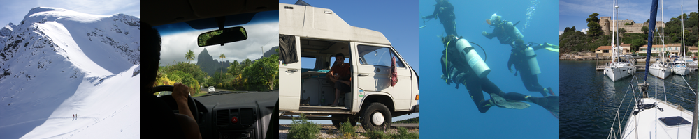
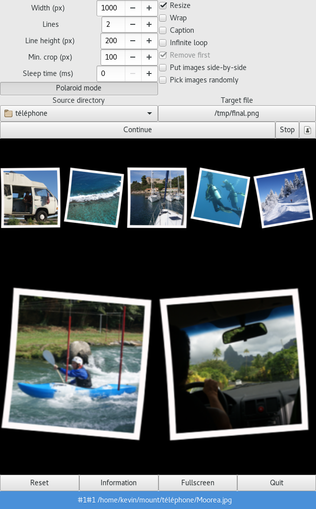

Photowall generator
===================

This is a GPL 3.0 Python photowall generator, relying on ImageMagick.
It is (and will remain) in "beta testing" version : I use it and it
fits my requirements, but there is no guarantee that it won't crash in
any different circunstances.

Python developers should be able to fix it and update it fairly easy,
although the code is a bit old and could benefit from a face lifting.

An example of customization for Python developers: Polaroid captions
are computed by function `photowall.get_file_details`. Just rewrite
this function to decide what you want to use for caption. Current code
(in the exception handler :$) takes the filename without extension and
replaces underscores by new lines.

Usage: 
------

     photowall.py <path> <target> [options]

     Arguments:
       <path>        The path where photos are picked up from. [default: /home/kevin/mount/téléphone]
       <target>      The path where the target photo is written. Except in POLAROID+RANDOM mode, the image will be blanked out first. [default: /tmp/final.png]

     Options:
       --polaroid              Use polaroid-like images for the wall
       --pick-random           Pick images randomly in the <path> folder. [default: False]
       --help                  Display this message

     Size options:
       --nb-lines <nb>         Number on lines of the target image. [default: 2]
       --line-height <height>  Set the height of a single image. [default: 200]
       --width <width>         Set final image width. [default: 1000]
       --no-resize             Resize images before putting in the wall. [default: False]

     Polaroid mode options:
       --crop-size <crop>      Minimum size to allow cropping an image, if it doesn't fit [default: 100]
       --no-caption            Disable caption. [default: True] 
       --put-random            Put images randomly instead of linearily. [default: False]
       --sleep <time>          If --put-random, time (in seconds) to go asleep before adding a new image. [default: 0]

     Collage mode options:
       --do-wrap               Finish images on the next line? [default: False]

Examples
--------

**Polaroid mode with caption**

    --polaroid  --nb-lines 1 --pick-random

**Polaroid mode with no caption**

    --polaroid --no-caption --nb-lines 1 --pick-random

**Collage mode**

    --nb-lines 1 --pick-random

**Polaroid random mode**

    --put-random --nb-lines 1 --pick-random

Graphical interface
-------------------

I built a graphical interface that should support all the command-line arguments:

